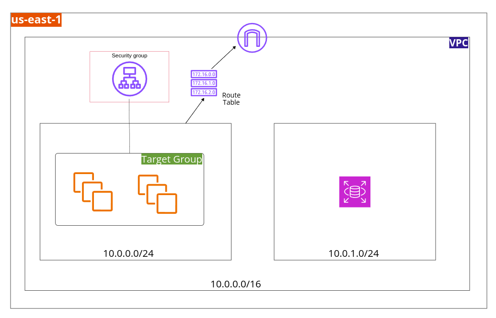

# Terraform Project

### Architecture 


### Steps to run the project

To run the project, first you need to have aws cli and terraform installed in the system. After that you can continue with the following steps.

1. Configure aws cli using command.

    ```
    aws configure
    ```
    AWS CLI will ask for access keys. It can be generated inside aws console in the IAM section.

2. Clone the repository locally.

3. Create a `terraform.tfvars` file and enter the following details.

    ```
    instance_ami = <AMI ID FOR THE TYPE OF INSTANCE YOU WANT TO CREATE>
    instance_key_name = <ADD KEY NAME FOR THE INSTANCE>
    database_password = <CHOOSE A PASSWORD FOR ADMIN OF RDS DATABASE>
    ```
4. In the project directory run the following command to initialize terraform.
    ```
     terraform init
    ```
    You will get few files inside the directory after completion of the command.

5. To check which all resources will be created.
    ```
    terraform plan
    ```

6. To create the resources.
    ```
    terraform apply
    ```

7. To get rid of all the changes.
    ```
    terraform destroy
    ```